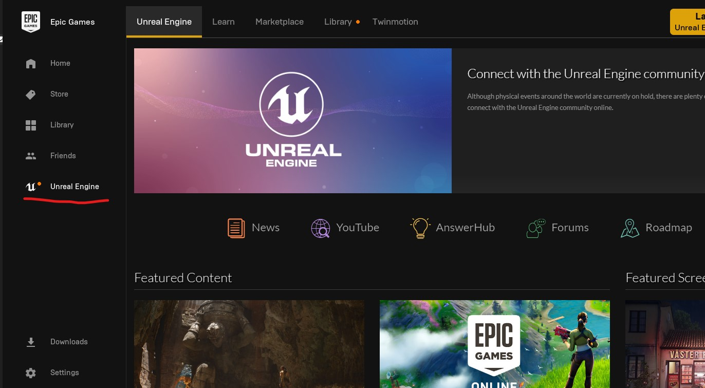

# Unreal Engine 4 Tutorial

## Preface

Unreal engine 4 is a powerful tool that has plenty of functionality built in. If you want a powerful 3D engine to build games, demos, or music videos (like the [Crab Rave](https://www.youtube.com/watch?v=cE0wfjsybIQ)), you are in the right place. For this tutorial, I will be using version 4.25.0 but following version should be quite similar

 

## Index

1. [Install](#setup)
2. [Overview](#overview)
3. [Models](#models)
4. 

## 1. Install

The Unreal engine is a product of Epic Games. Like Unity, it is free to use if your game makes less than $1 000 000 USD in **revenue (not profit)**. After which, 5% goes to Epic. 

1. Sign in/Register to [Epic Games](www.epicgames.com/id/login) (note you can use Google, Facebook, Xbox Live, PlayStation Network, or Nintendo to sign in)

2. Download and install the Epic Game Launcher

3. On the left tab will be a section for Unreal Engine

   

   Click it

4. As seen above, there are 5 tabs

   1. **Unreal Engine** is where you will see the news about Unreal Engine and some useful links

   2. **Learn** contains links to documentation and other exemplar content

   3. **Marketplace** is a store of assets, plugins and many other things relevant to the Unreal Engine (there are tons of free stuff from Epic and other creators so don't be afraid to import or add from the marketplace)

   4. **Library** is where you will see projects (if you have any) and the version of the Unreal Engine you will be installing. For this tutorial, I will be using 4.25.0. To add an engine, click the plus icon in the **ENGINE VERSIONS** and the newest stable version should be displayed. 

      

   5. **Twinmotion** is a CAD plugin that is irrelevant to this tutorial

5. Next click install and follow the prompts. (\*note, the install will take a long time)

6. Click Launch

7. After a couple of prompts, it will initialize and a new window asking for the project template will pop up

8. For this tutorial, we will use a blank template (**Games -> Blank**) but feel free to use one of Unreal's starting points because the template are well thought out and can be quite useful as a starting off point

9. In the project settings, I will leave it with the default but feel free to change the settings to your liking (most of options are self explanatory and you can change these options later)

10. Change the location of the project and select **Create project**

11. After initializing, you will have a new Unreal project!

\* init notes:

If you see that the new Unreal project is taking a lot of storage, it is mostly texture images, therefore, if you want to save space, simply delete the textures folder or what do what I do, which is to move all the textures outside the Unreal project and put it in another folder, only moving some textures and their normal maps when I need to use them in the project.

\* Requirement notes:

Unreal is not a trivial engine and can be quite expensive computationally. Therefore, look at the [requirements](https://docs.unrealengine.com/en-US/GettingStarted/RecommendedSpecifications/index.html) in the Unreal site to  see if your computer is up for the task of running Unreal

## 2. Unreal Editor Overview

Unreal Engine is a windowed application with many panels that are dock-able anywhere in the window. By default, the left most side is a window called **Place Actors**. This tab handles added 3D objects, including

* volumes

* characters

* lights

* cameras

* effects

* geometry, and

* more...

In the center is the scene view. This is where you can preview and play. 

On the bottom corner is the **Content Browser**, which allows you to go through files/assets in the project directory. 

Starting at the top right side is the World Outliner, this is like a layer panel in Photoshop or the scene manager in Blender. This is the area where all items in the scene can be selected and modified in the tab below. 

This tab is called **details** and does what it says. You can control the details of the item selected. For different items, theses details will be different, but a great majority will have the transform options. These transform options can move where the object is located in 3D space. In most cases however, the better way to manipulate where the object is located is with the 3D viewport.

Of course with these panels/windows, you can move any of the windows to suit them to your needs. 

One thing that is different from previous versions, is the different modes (ie paint, landscape, foliage, and geometry). By default, you will not see the different modes, so if you are following an old tutorial, don't worry, the modes are still there. Now the easiest way to access it is to use the Shift-#number shortcut. Please resort to the [Unreal documentation](https://docs.unrealengine.com/en-US/Engine/UI/LevelEditor/Modes/index.html) to stay up to date

## 3. Models

Unreal is a 3D engine, therefore, it come with many great tools and libraries. By default, Unreal will start you off with a StarterContent folder with many things including models you can drag into the scene. 

